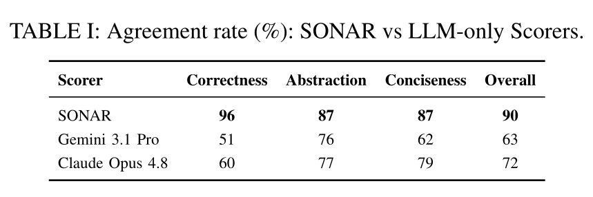
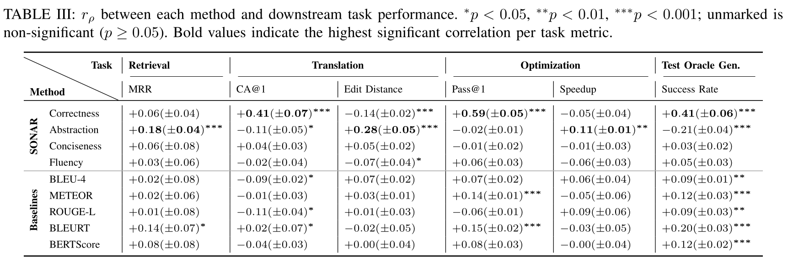
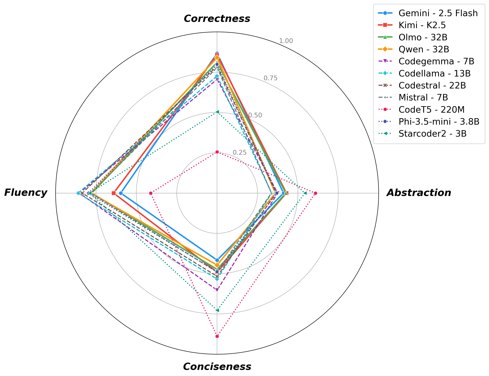
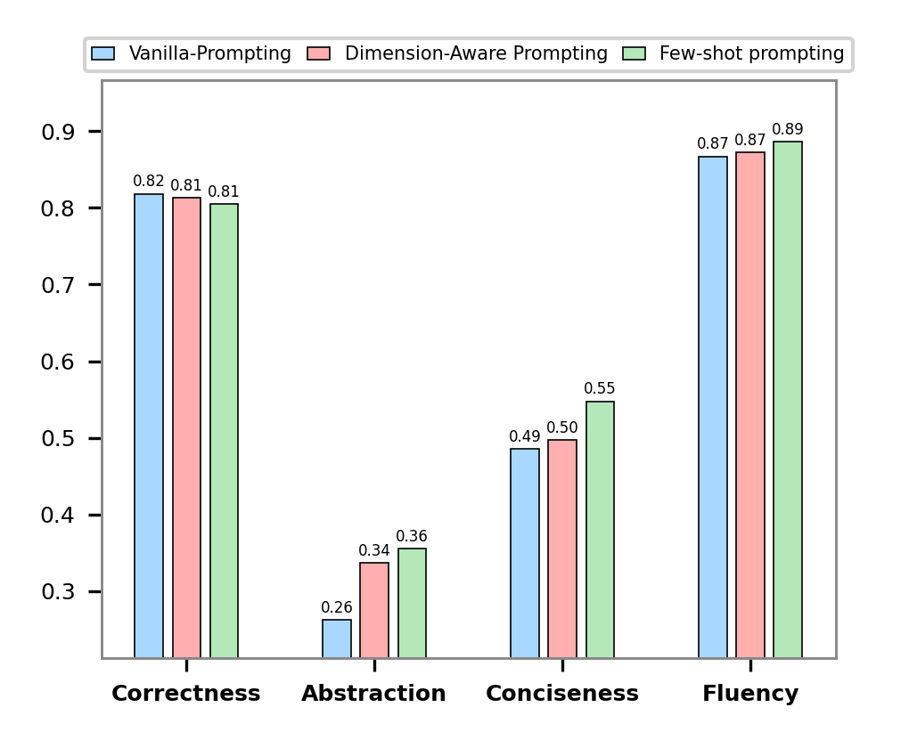
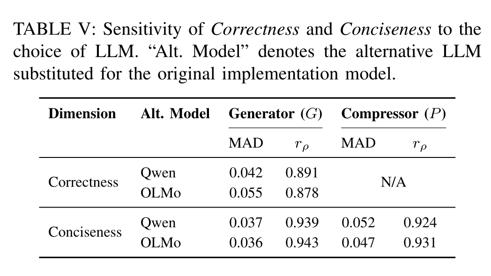

# SONAR
This repository contains the **replication package** introduced in the paper:

> ## SONAR: Reference-Free, Task-Aware Evaluation of Code Summaries from the Perspective of LLMs

<br>

**Note:** For consistency, figures and tables in this README use the same numbering as in the paper.

---
## :gear: Conda Environment
1. Create a Conda env
```bash
conda create -n sonar python=3.10
```
2. Activate the environment
```bash
conda activate sonar
```
3. Install dependencies
```bash
pip install -r requirements.txt
```

## :bar_chart: Reproducing RQ1 results
```bash
cd Experiments/RQ1/scripts
chmod +x run.sh
./run.sh
```
This will generate Table I inside the [`Experiments/RQ1/results`](Experiments/RQ1/results) directory.


## :bar_chart: Reproducing RQ2 results
```bash
cd Experiments/RQ2/scripts
chmod +x run.sh
./run.sh
```
This will generate Table III inside the [`Experiments/RQ2/results`](Experiments/RQ2/results) directory.


## :bar_chart: Reproducing RQ3 results
```bash
cd Experiments/RQ3/scripts
chmod +x run.sh
./run.sh
```
This will generate Figure 5 and Figure 6 inside the [`Experiments/RQ3/results`](Experiments/RQ3/results) directory.




## :bar_chart: Reproducing RQ4 results
```bash
cd Experiments/RQ4/scripts
chmod +x run.sh
./run.sh
```
This will generate Table V inside the [`Experiments/RQ4/results`](Experiments/RQ4/results) directory.


---
## :robot: Running the SONAR Framework
[`SONAR_Framework`](SONAR_Framework) is the standalone tool underlying all four RQs above: for each task in the bundled benchmark (`SONAR_Framework/datasets`, 500 functions across HumanEval, MBPP, BigCodeBench, and TheVault), it generates summaries with any of 11 models and scores those summaries on all four SONAR dimensions (correctness, abstraction, conciseness, fluency).
```bash
cd SONAR_Framework
chmod +x run.sh
./run.sh
```
See [`SONAR_Framework/run.sh`](SONAR_Framework/run.sh) for detailed setup instructions.
